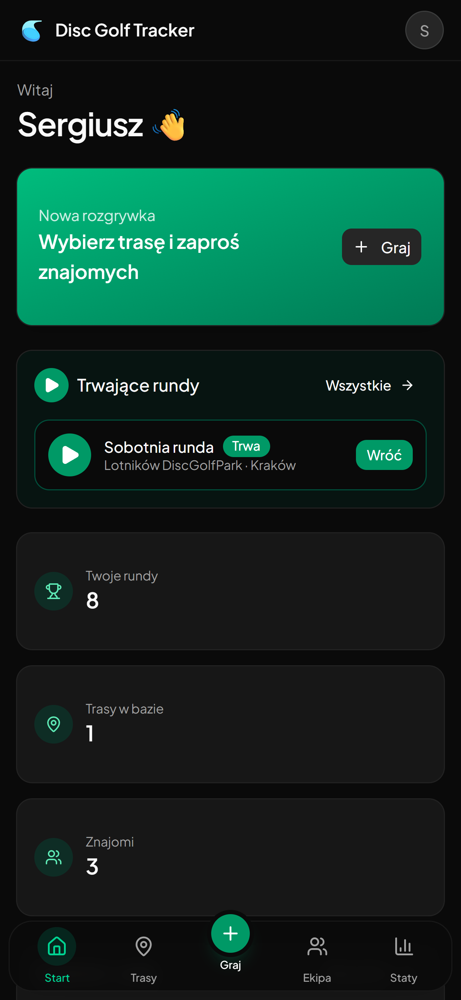
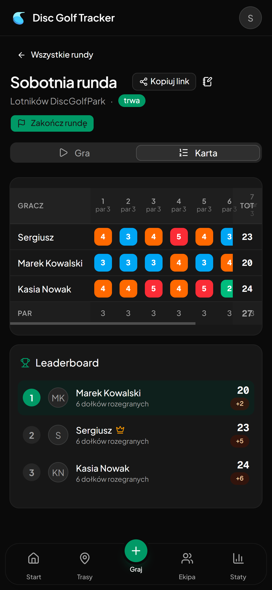
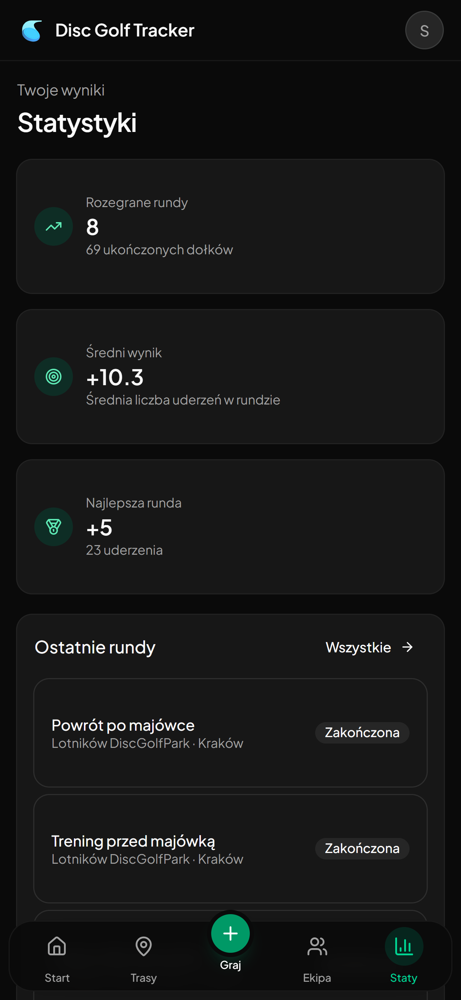
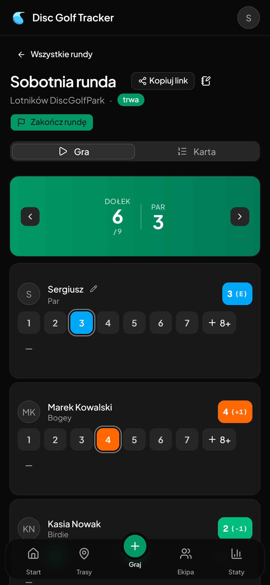
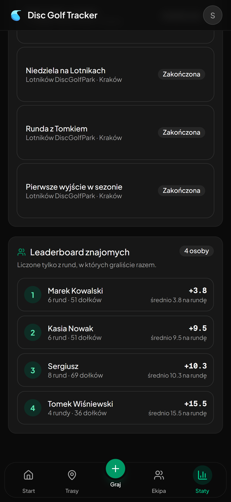

# 🥏 Disc Golf Tracker

## 📋 Overview

A Progressive Web App for tracking disc golf rounds — live scorecard, friends leaderboard and round history, all in one place.

## 🌐 Live Demo

Visit the live app at: **[discgolftracker.sergiusz.dev](https://discgolftracker.sergiusz.dev)**

## 🖼️ Preview

  
  
  

 

  
  

## ✨ Features

- Live scorecard with per-hole score entry and real-time sync across devices
- Round summary with stroke distribution (birdie, bogey, eagle) and relative-to-par breakdown
- Statistics page tracking average score and personal best across all played rounds
- Friends leaderboard scoped to people you have actually played with, ranked by average score per round
- Installable as a PWA with offline support via service worker

## 🛠️ Tech Stack

- Next.js 16 (App Router, TypeScript)
- Supabase (Postgres, Auth, Realtime)
- Tailwind CSS v4 + shadcn/ui
- Google OAuth + email/password auth
- next-intl (Polish & English)
- Vercel